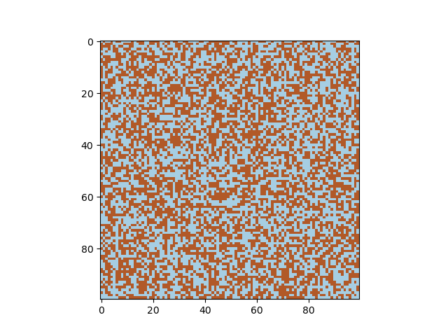
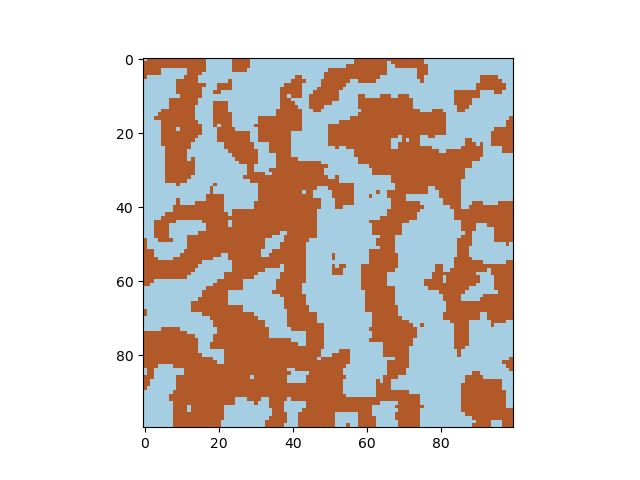

# Speed up Python code with Carma

Python is lovely, but what if you want something both lovely and fast? 

I'll show you how to get a **factor `250x` speedup** using wrapped `C++` code. 


[Image source](https://www.flickr.com/photos/flickryeung/37534621620/in/album-72157688076103694/) and [license](https://creativecommons.org/licenses/by/2.0/).

It's not Python's fault - more that of all interpereted languages. We start out by writing an algorithm that we understand, but is terrible in performance. We can try to optimize the code by reworking the algorithm, adding GPU support, etc., etc., but let's face it: optimizing code by hand is exhausting. Don't you just wish there were a magic... thing... existed that you could run over your code to make it faster? A magic thing called a... compiler?

`pybind11` is a fantastic library you can use to wrap `C++` code into `Python` - and the modern `C++` compiler is a magic optimization wizard. 
* For a tutorial to get started with `Python`, `C++` and `pybind11` using `CMake`, [see this article here](https://medium.com/practical-coding/setting-up-a-c-python-project-with-pybind11-and-cmake-8de391494fca).
* For a tutorial on some advanced features in `pybind11`, [see this article here](https://medium.com/practical-coding/three-advanced-pybind11-features-for-wrapping-c-code-into-python-6dbcac169b93).

The most common package in `Python` has to be `NumPy` - `NumPy` arrays are absolutely everywhere. In `C++`, the [Armadillo](http://arma.sourceforge.net) library is highly optimized, easy to use, and widely adopted (did you know [MLPack](https://www.mlpack.org) is built on `Armadillo`?). The common `Armadillo` data types are for matrices and column and row vectors. Chances are: if you have an algorithm in Python using `NumPy`, you will be easily able to rewrite it with the methods native to `Armadillo`.

[Carma](https://carma.readthedocs.io/en/latest/) is exactly what you wanted - a library to help you wrap back and forth between `Armadillo` and `NumPy` data types. It's exactly what a `C++` library should be - header only, well documented, and powerful. You can grab the source for `Carma` [here](https://github.com/RUrlus/carma), and the documentation [here](https://carma.readthedocs.io/en/latest/).

Here we will use Carma to wrap a simple Gibbs sampler for an Ising model. [You can find the entire code for this project here.](https://github.com/smrfeld/speed-up-python-with-carma)

## Overview of Carma

Let's check out the main commands in `Carma`:
```
// NumPy array to Armadillo matrix - NOT COPIED by default
arma::mat arma_mat = carma::arr_to_mat<double>(np_array_mat);

// Convert back - NOT COPIED by default
py::array_t<double> np_array_mat = carma::mat_to_arr<double>(arma_mat);

// NumPy array to Armadillo column vector - NOT COPIED by default
arma::vec arma_vec = carma::arr_to_vec<double>(np_array_vec);

// Convert back - COPIED by default
py::array_t<double> np_array_vec = carma::col_to_arr<double>(arma_vec);
```
There are also similarly commands for row vectors and cubes.

For efficiency, it's crucial to think about when an object is **copied** or **not**. The default behavior is a little confusing:
* Everything is **not copied** by default, except:
* Armadillo column/row vectors to NumPy arrays are **copied** by default.

To change the default behavior, check out `convertors.h` in the `Carma` source. You can instead use the signatures:
```
template <typename T> inline py::array_t<T> mat_to_arr(arma::Mat<T> * src, bool copy=false)
template <typename T> inline py::array_t<T> col_to_arr(arma::Col<T> * src, bool copy=true)
template <typename T> inline py::array_t<T> row_to_arr(arma::Row<T> * src, bool copy=true)
template <typename T> inline py::array_t<T> cube_to_arr(arma::Cube<T> * src, bool copy=true)
template <typename T> arma::Mat<T> arr_to_mat(py::handle src, bool copy=false, bool strict=false)
template <typename T> arma::Col<T> arr_to_col(py::handle src, bool copy=false, bool strict=false)
template <typename T> arma::Row<T> arr_to_row(py::handle src, bool copy=false, bool strict=false)
template <typename T> arma::Cube<T> arr_to_cube(py::handle src, bool copy=false, bool strict=false)
```

## Gibbs Sampler algorithm

Let's review a super simple [Gibbs sampler](https://en.wikipedia.org/wiki/Gibbs_sampling) algorithm. First, initialize a 2D lattice of `-1/+1` spins. Then, iteratively:
* Choose a random lattice site.
* Calculate the difference in energy if we flip the spin: `Energy diff = Energy after - energy before`.
* Accept the flip with probability `exp(Energy diff)`, i.e. generate a random uniform `r` in `[0,1]` and accept the flip if `r < min(exp(Energy diff), 1)`.

For the 2D [Ising model](https://en.wikipedia.org/wiki/Ising_model) with coupling parameter `J` and bias `b`, the energy difference for flipping spin `s` with neighbors `s_left, s_right, s_down, s_up`:
```
- 2 * b * s - 2 * J * s * ( s_left + s_right + s_down + s_up )
```

## Pure Python

Let's start with a simple implementation of the Gibbs Sampler. Make a file `simple_gibbs_python.py` with contents:
```
import NumPy as np

class GibbsSampler:

    """Constructor
    """
    def __init__(self, no_units : int, coupling : float, bias : float):
        """Gibbs sampler

        Args:
            no_units (int): No units
            coupling (float): Coupling
            bias (float): Bias
        """

        self.no_units = no_units
        self.coupling = coupling
        self.bias = bias

    def get_random_state(self) -> np.array:
        """Get random state

        Returns:
            np.array: Random no_units x no_units state of -1 or 1
        """
        return 2 * ( 2 * np.random.rand(self.no_units, self.no_units) ).astype(int) - 1 # Randomly 0 or 1

    def sample(self, state_init : np.array, no_steps : int) -> np.array:
        """Perform Gibbs sampling

        Args:
            state_init (np.array): Initial state of -1/1
            no_steps (int): No steps to sample

        Returns:
            np.array: List of sampled units in each state
        """

        # Initialize state of 0 or 1
        state = state_init.astype(int)

        # Iterate over no steps
        for i_step in range(0,no_steps):

            if i_step % 10000 == 0:
                print("%d / %d" % (i_step,no_steps))

            # Pick a random idx
            i,j = np.random.randint(0,self.no_units,2)

            # Energy change
            energy_diff = self.bias * -2 * state[i,j]
            if i != 0:
                energy_diff += self.coupling * state[i-1, j] * -2 * state[i,j]
            if i != self.no_units-1:
                energy_diff += self.coupling * state[i+1, j] * -2 * state[i,j]
            if j != 0:
                energy_diff += self.coupling * state[i, j-1] * -2 * state[i,j]
            if j != self.no_units-1:
                energy_diff += self.coupling * state[i, j+1] * -2 * state[i,j]

            # Sample
            r = np.random.rand()
            if r < np.exp(energy_diff):
                # Flip 
                state[i,j] = - state[i,j]

        return state
```
We have two methods: one with returns a random state (a 2D NumPy array of 0 or 1), and one which takes an initial state, samples it, and returns the final state. 

Let's write a simple test for it. Make a file called `test.py` with contents:
```
import simple_gibbs_python as gs
import matplotlib.pyplot as plt
import time

if __name__ == "__main__":
    
    no_units = 100
    coupling = 1
    bias = 0.0

    sampler = gs.GibbsSampler(
        no_units=no_units,
        coupling=coupling,
        bias=bias
        )

    # Sample
    t0 = time.time()
    no_steps = 100000
    state_init = sampler.get_random_state()
    state = sampler.sample(state_init, no_steps)
    t1 = time.time()

    print("Duration: %f seconds" % (t1-t0))

    # Plot
    plt.figure()
    plt.imshow(state_init, cmap="Paired")
    
    plt.figure()
    plt.imshow(state, cmap="Paired")
    plt.show()
```
Here we create a `100x100` lattice with bias `0` and coupling parameter `1`. We sample for 100,000 steps. Below are a examples of an initial state and a final state:





Timing the code gives:
```
Duration: 2.611175 seconds
```
That's way too long! Let's try to write the same code in `C++` and see if we get an improvement.

## Pure C++

Next, let's write a simple library in `C++` to do the same thing. We will organize the directory as follows:
```
gibbs_sampler_library/cpp/CMakeLists.txt
gibbs_sampler_library/cpp/include/simple_gibbs
gibbs_sampler_library/cpp/include/simple_gibbs_bits/gibbs_sampler.hpp
gibbs_sampler_library/cpp/src/gibbs_sampler.cpp
```
The reason for placing the entire project in the `cpp` folder inside another folder called `gibbs_sampler_library` will be to enable us to wrap it into `Python` later.

The CMake file is used to build a library called `simple_gibbs`:
```
cmake_minimum_required(VERSION 3.1)

set(CMAKE_CXX_STANDARD 17)
set(CMAKE_CXX_STANDARD_REQUIRED ON)
set(CMAKE_CXX_EXTENSIONS OFF)

project(simple_gibbs VERSION 0.1.0)

# Include dir
include_directories(/usr/local/include)

# Src
AUX_SOURCE_DIRECTORY(src SRC_FILES)

# Headers
set(PROJECT_SOURCE_DIR "src")
set(PROJECT_INCLUDE_DIR "include/simple_gibbs_bits")

# Source files
set(SOURCE_FILES
    ${PROJECT_INCLUDE_DIR}/gibbs_sampler.hpp
    ${PROJECT_SOURCE_DIR}/gibbs_sampler.cpp
)

# Set up such that XCode organizes the files correctly
source_group(TREE ${CMAKE_CURRENT_SOURCE_DIR} FILES ${SOURCE_FILES})

# Required library
find_library(ARMADILLO_LIB armadillo HINTS /usr/local/lib/ REQUIRED)

# Add library
add_library(simple_gibbs SHARED ${SOURCE_FILES})

# Link
target_link_libraries(simple_gibbs PUBLIC ${ARMADILLO_LIB})

# Include directories
target_include_directories(simple_gibbs PRIVATE include/simple_gibbs_bits)

# Install
install(TARGETS simple_gibbs DESTINATION lib)

# Install the headers
install(FILES include/simple_gibbs DESTINATION include)

# Create base directory
install(DIRECTORY include/simple_gibbs_bits DESTINATION include)
```

The header file is:
```
#include <string>

#include <armadillo>

#ifndef GIBBS_SAMPLER_H
#define GIBBS_SAMPLER_H

namespace gibbs {

class GibbsSampler {

private:

    /// No units in each dim
    int _no_units;
    
    /// Coupling
    double _coupling;
    
    /// Bias
    double _bias;

public:

    /// Constructor
    GibbsSampler(int no_units, double coupling, double bias);

    /// Get random state of 0 or 1
    /// @return 2D state of random 0 or 1
    arma::imat get_random_state() const;

    /// Sample
    /// @param state_init Initital state
    /// @param no_steps No steps to sample
    /// @return Final state after sampling
    arma::imat sample(const arma::imat &state_init, int no_steps) const;
};

}

#endif
```
and the source file is:
```
#include "../include/simple_gibbs_bits/gibbs_sampler.hpp"

#include <iostream>

namespace gibbs {

GibbsSampler::GibbsSampler(int no_units, double coupling, double bias) {
    _no_units = no_units;
    _coupling = coupling;
    _bias = bias;
}

arma::imat GibbsSampler::get_random_state() const {
    return 2 * arma::randi( _no_units, _no_units, arma::distr_param(0,1) ) - 1;
}

arma::imat GibbsSampler::sample(const arma::imat &state_init, int no_steps) const {
    
    // Copy state of 0 or 1
    arma::imat state = state_init;

    // Iterate over no steps
    for (auto i_step=0; i_step<no_steps; i_step++) {
        
        if (i_step % 10000 == 0) {
            std::cout << i_step << " / " << no_steps << std::endl;
        }

        // Pick a random idx
        int i = arma::randi( arma::distr_param(0,_no_units-1) );
        int j = arma::randi( arma::distr_param(0,_no_units-1) );

        // Energy change
        double energy_diff = _bias * -2 * state(i,j);
        if (i != 0) {
            energy_diff += _coupling * state(i-1, j) * -2 * state(i,j);
        }
        if (i != _no_units-1) {
            energy_diff += _coupling * state(i+1, j) * -2 * state(i,j);
        }
        if (j != 0) {
            energy_diff += _coupling * state(i, j-1) * -2 * state(i,j);
        }
        if (j != _no_units-1) {
            energy_diff += _coupling * state(i, j+1) * -2 * state(i,j);
        }

        // Sample
        double r = arma::randu();
        if (r < exp(energy_diff)) {
            // Flip
            state(i,j) = - state(i,j);
        }
    }
 
    return state;
}

}
```
Notice again that we didn't rewrite the code in any smarter way - we have the same `for` loops and approach as in `Python`.

We can build the library with
```
cd gibbs_sampler_library/cpp
mkdir build
cd build
cmake ..
make
make install
```

There is also a simple helper header file `include/simple_gibbs`:
```
#ifndef SIMPLE_GIBBS_H
#define SIMPLE_GIBBS_H

#include "simple_gibbs_bits/gibbs_sampler.hpp"

#endif
```
such that we can simply use `#include <simple_gibbs>` later.

Next, let us make a simple test `test.cpp` for our library:
```
#include <simple_gibbs>

#include <iostream>

int main() {

    int no_units = 100;
    double coupling = -1;
    double bias = 0.0;

    gibbs::GibbsSampler sampler(no_units, coupling, bias);

    // Sample
    auto start = std::chrono::high_resolution_clock::now();

    int no_steps = 100000;
    arma::imat state_init = sampler.get_random_state();
    arma::imat state = sampler.sample(state_init, no_steps);

    auto stop = std::chrono::high_resolution_clock::now();
    auto duration = std::chrono::duration_cast<std::chrono::milliseconds>(stop - start).count();
    
    std::cout << "Duration: " << duration << " milliseconds" << std::endl;
    
    return 0;
}
```

We can again build this using a `CMake` file, or just:
```
g++ test.cpp -o test.o -lsimple_gibbs
```
Running it gives (on average):
```
Duration: 50 milliseconds
```
Wow! That's `500x` faster than the Python code! Notice again that we didn't rewrite the code in `C++` in the `gibbs_sampler.cpp` file in any smarter way - we have the same `for` loops and approach as in `Python`. It's the magic of optimization in modern `C++` compilers that gave us that great improvement.

That is true luxury of compiled languages that even other optimization approaches in `Python` cannot rival. For example, we could have used `cupy` (Cuda + NumPy) to take advantage of GPU support, and rewritten the algorithm to use more vector and matrix operations. Certainly this will boost performance, but it is hand-tuned optimization. In `C++`, the compiler can help us optimize our code, even if we remain ignorant of it's magic.

But now we want to bring our great `C++` code back into `Python` - enter `Carma`.

## Wrapping the C++ library into Python using Carma

`Carma` is a great header-only library for converting between `armadillo` matrices/vectors and `NumPy` arrays. Let's jump right in. The directory structure is:
```
gibbs_sampler_library/CMakeLists.txt
gibbs_sampler_library/python/gibbs_sampler.cpp
gibbs_sampler_library/python/simple_gibbs.cpp
gibbs_sampler_library/python/carma/...
gibbs_sampler_library/cpp/...
```
There are two folders here:
1. `gibbs_sampler_library/cpp/...` - this is all the `C++` code from the previous part.
2. `gibbs_sampler_library/python/carma/...` - this is the `Carma` header-only library. Go ahead and navigate to the [GitHub repo](https://github.com/RUrlus/carma) and copy the `include/carma` library into the `python` directory. You should have:
    ```
    gibbs_sampler_library/python/carma/carma.h
    gibbs_sampler_library/python/carma/carma/arraystore.h
    gibbs_sampler_library/python/carma/carma/converters.h
    gibbs_sampler_library/python/carma/carma/nparray.h
    gibbs_sampler_library/python/carma/carma/utils.h
    ```

Now let's look at the other files. The CMake file can be used to build the `Python` library:
```
cmake_minimum_required(VERSION 3.1)

set(CMAKE_CXX_STANDARD 17)
set(CMAKE_CXX_STANDARD_REQUIRED ON)
set(CMAKE_CXX_EXTENSIONS OFF)

if(NOT CMAKE_BUILD_TYPE)
  set(CMAKE_BUILD_TYPE Release)
endif()

set(CMAKE_CXX_FLAGS "-O3")
set(CMAKE_CXX_FLAGS_RELEASE "-O3")

project(simple_gibbs)

include_directories(/usr/local/include)
include_directories("${CMAKE_SOURCE_DIR}/cpp/include/simple_gibbs_bits")
include_directories("${CMAKE_SOURCE_DIR}/python")
include_directories("${CMAKE_SOURCE_DIR}/python/carma")

file (GLOB SOURCE_FILES "cpp/src/*.cpp")
file (GLOB HEADER_FILES "cpp/include/simple_gibbs_bits/*.hpp")
file (GLOB PYTHON_FILES "python/*.cpp" "python/*.hpp" "python/carma/*.h" "python/carma/carma/*.h")

# Set up such that XCode organizes the files
source_group(TREE ${CMAKE_CURRENT_SOURCE_DIR} FILES ${SOURCE_FILES} ${HEADER_FILES} ${PYTHON_FILES} )

# Armadillo
find_library(ARMADILLO_LIB armadillo HINTS /usr/local/lib/ REQUIRED)

# Pybind11
find_package(pybind11 REQUIRED)
pybind11_add_module(simple_gibbs 
	${SOURCE_FILES}
	${HEADER_FILES}
	${PYTHON_FILES}
)

target_link_libraries(simple_gibbs PUBLIC ${ARMADILLO_LIB})

install(TARGETS simple_gibbs
  COMPONENT python
  LIBRARY DESTINATION "${PYTHON_LIBRARY_DIR}"
  )
```
Note that `pybind11_add_module` takes the place of the usual `add_library`, and has many of the same options. When we use `CMake` here, we have to specify:
```
cmake .. -DPYTHON_LIBRARY_DIR="~/opt/anaconda3/lib/python3.7/site-packages" -DPYTHON_EXECUTABLE="~/opt/anaconda3/bin/python3"
```
Make sure you adjust your paths accordingly.

The main entry point for the `Python` library is the `simple_gibbs.cpp` file:
```
#include <pybind11/pybind11.h>

namespace py = pybind11;

void init_simple_gibbs(py::module &);

namespace mcl {

PYBIND11_MODULE(simple_gibbs, m) {
    // Optional docstring
    m.doc() = "Simple Gibbs library";
    
    init_simple_gibbs(m);
}
}
```

So far, `Carma` hasn't made an appearance. Let's change that in the `gibbs_sampler.cpp` file.
There are two ways to convert between NumPy arrays and Armadillo matrices:
1. Automatic conversion as described [here](https://carma.readthedocs.io/en/latest/basic_usage.html#automatic-conversion).
2. Manual conversion as described [here](https://carma.readthedocs.io/en/latest/basic_usage.html#manual-conversion).

I'm going to cover the manual conversion, since it's clearer. Automatic conversion will save you writing a couple lines, but it's nice to see what can be done in general.

To use the manual conversion, we're gonna make a new subclass of `GibbsSampler` called `GibbsSampler_Cpp`. 
* It inherits the constructor from `GibbsSampler`, since it doesn't involve Armadillo.
* The first method is:
    ```
    py::array_t<double> get_random_state() const {
        
        // Call
        arma::imat state_arma = GibbsSampler::get_random_state();
        
        // Convert back to NumPy
        py::array_t<double> state = carma::mat_to_arr<arma::sword>(state_arma);
        
        return state;
    }
    ```
    Note this is the same name as the `C++` method `arma::imat get_random_state() const`, but with a `Python` return signature. We called the pure `C++` method, and converted the returned matrix back into `NumPy`. Also note that we have to import `#include <pybind11/NumPy.h>` to use `py::array_t<double>`.
* Similarly, the second method is:
    ```
    py::array_t<double> sample(const py::array_t<double> &state_init, int no_steps) const {
        
        // Convert to arma
        arma::imat state_init_arma = carma::arr_to_mat<arma::sword>(state_init);
        
        // Call
        arma::imat state_arma = GibbsSampler::sample(state_init_arma, no_steps);
        
        // Convert back to NumPy
        py::array_t<double> state = carma::mat_to_arr<arma::sword>(state_arma);
        
        return state;
    }
    ```
    Here we are converting both in the input from `NumPy` to `Armadillo`, and the output back from `Armadillo` to `NumPy`.

Finally, we must wrap the library using the standard `pybind11` glue code:
```
void init_simple_gibbs(py::module &m) {
    
    py::class_<gibbs::GibbsSampler>(m, "GibbsSampler_Parent");
    
    py::class_<gibbs::GibbsSampler_Cpp, gibbs::GibbsSampler>(m, "GibbsSampler")
    .def(py::init<int, double, double>(), py::arg("no_units"), py::arg("coupling"), py::arg("bias"))
    .def("get_random_state",
         py::overload_cast<>( &gibbs::GibbsSampler_Cpp::get_random_state, py::const_))
    .def("sample",
         py::overload_cast<const py::array_t<double>&, int>( &gibbs::GibbsSampler_Cpp::sample, py::const_),
         py::arg("state_init"), py::arg("no_steps"));
}
```
Note that we renamed the classes from `C++` to `Python`:
* `GibbsSampler` in `C++` -> `GibbsSampler_Parent` in `Python` (exposed but methods not wrapped).
* `GibbsSampler_Cpp` in `C++` -> `GibbsSampler` in `Python`.
This way, we can use the same notation `GibbsSampler` in `Python` at the end.

The complete `python/gibbs_sampler.cpp` file is:
```
#include "../cpp/include/simple_gibbs_bits/gibbs_sampler.hpp"

#include <armadillo>

// pybind11
#include <pybind11/NumPy.h>
#include <pybind11/stl.h>
#include <pybind11/pybind11.h>
namespace py = pybind11;

// Carma
#include <carma/carma.h>

namespace gibbs {

class GibbsSampler_Cpp : public GibbsSampler {
    
public:
    
    using GibbsSampler::GibbsSampler;
    
    py::array_t<double> get_random_state() const {
        
        // Call
        arma::imat state_arma = GibbsSampler::get_random_state();
        
        // Convert back to NumPy
        py::array_t<double> state = carma::mat_to_arr<arma::sword>(state_arma);
        
        return state;
    }
    
    py::array_t<double> sample(const py::array_t<double> &state_init, int no_steps) const {
        
        // Convert to arma
        arma::imat state_init_arma = carma::arr_to_mat<arma::sword>(state_init);
        
        // Call
        arma::imat state_arma = GibbsSampler::sample(state_init_arma, no_steps);
        
        // Convert back to NumPy
        py::array_t<double> state = carma::mat_to_arr<arma::sword>(state_arma);
        
        return state;
    }
};

}

void init_simple_gibbs(py::module &m) {
    
    py::class_<gibbs::GibbsSampler>(m, "GibbsSampler_Parent");
    
    py::class_<gibbs::GibbsSampler_Cpp, gibbs::GibbsSampler>(m, "GibbsSampler")
    .def(py::init<int, double, double>(), py::arg("no_units"), py::arg("coupling"), py::arg("bias"))
    .def("get_random_state",
         py::overload_cast<>( &gibbs::GibbsSampler_Cpp::get_random_state, py::const_))
    .def("sample",
         py::overload_cast<const py::array_t<double>&, int>( &gibbs::GibbsSampler_Cpp::sample, py::const_),
         py::arg("state_init"), py::arg("no_steps"));
}
```

Go ahead and build that:
```
cd gibbs_sampler_library
mkdir build
cd build
cmake .. -DPYTHON_LIBRARY_DIR="~/opt/anaconda3/lib/python3.7/site-packages" -DPYTHON_EXECUTABLE="~/opt/anaconda3/bin/python3"
make
make install
```
Make sure you adjust your paths.

## Test the wrapped library in Python

Exciting! Hard work but we are ready to test our `C++` library wrapped into `Python`. In the `test.py` file from the "Pure Python" section above, we can just change one import line as follows:
```
import simple_gibbs_python as gs
```
to
```
import simple_gibbs as gs
```
and run it again. The output I get is:
```
Duration: 0.010237 seconds
```
Bang! That's `250x` faster, even with the conversions! The pure `C++` code was `500x` faster, so we get a factor `1/2` slowdown from the overhead of (1) calling the `C++` code and (2) converting between `NumPy` arrays and `Armadillo` matrices. Still, the improvement is significant!

## Final thoughts

That's all for this intro. All credit to `Carma`, not the least for it's great [documentation](https://carma.readthedocs.io/en/latest/).

[You can find the entire code for this project here.](https://github.com/smrfeld/speed-up-python-with-carma)

Related articles in [Practical Coding](https://medium.com/practical-coding):
* For a tutorial to get started with `Python`, `C++` and `pybind11` using `CMake`, [see this article here](https://medium.com/practical-coding/setting-up-a-c-python-project-with-pybind11-and-cmake-8de391494fca).
* For a tutorial on some advanced features in `pybind11`, [see this article here](https://medium.com/practical-coding/three-advanced-pybind11-features-for-wrapping-c-code-into-python-6dbcac169b93).